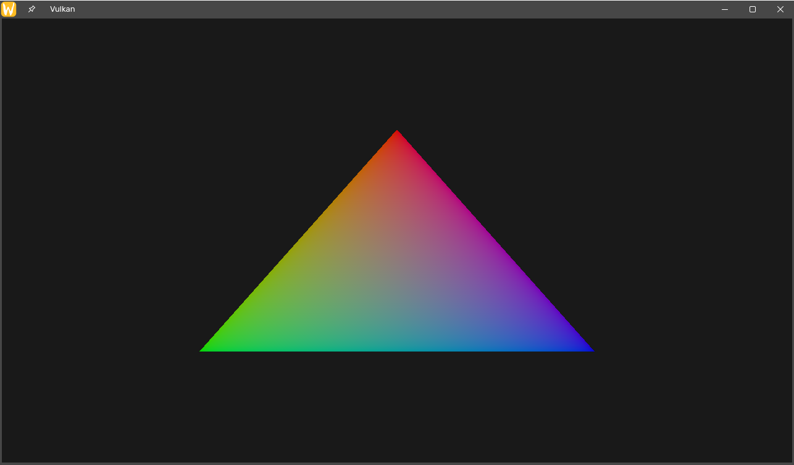

# glvk

## About



OpenGL + Vulkan with SDL3 multi-API project

## Setup

### Linux

Use linux package manager to install `g++`, `glfw`, `glad`, `sdl3`, `volk`, and `vulkan-validation-layers`.

> \[!TIP]
> Optionally copy [glad](https://glad.dav1d.de/) web service include directories `glad` and `KHR` to `/usr/include/`.

### Windows

Install latest GPU driver, [cmake](https://cmake.org/download/), [glfw](https://www.glfw.org/download.html), [glad](https://glad.dav1d.de/), [LunarG](https://vulkan.lunarg.com/) and Visual Studio.

Make sure `x64` build selected, from project -> properties set platform to all platforms then under configuration properties -> `VC++` directories open include directories point to the include directory that has `GLFW`, `glad`, and `KHR` inside. Do the same for library directories pointing to the `lib` directory that has `glfw3.lib`. Next up go to the linker -> input and write `glfw3.lib` and `opengl32.lib` in additional dependencies. Finally drag and drop `glad.c` to the source files of solution explorer.

## Build

First time setup:

```sh
meson setup build
```

Changes to `meson.build`:

```sh
meson setup --reconfigure build && ninja install -C build
```

Build and run:

```sh
meson compile -C build && ./build/glvk.out
```

## Attributions

OpenGL, glTF, and Vulkan are all copyrights of [Khronos Group](https://github.com/KhronosGroup/Vulkan-Headers/blob/main/LICENSE.md)

Simple DirectMedia Layer (SDL) is distributed under the terms of the [zlib](https://github.com/libsdl-org/SDL/blob/main/LICENSE.txt)

[Volk](https://github.com/zeux/volk) and [VulkanMemoryAllocator](https://github.com/GPUOpen-LibrariesAndSDKs/VulkanMemoryAllocator) are licensed under the terms of MIT:

```
Copyright (c) 2017-2026 Advanced Micro Devices, Inc. All rights reserved.

Permission is hereby granted, free of charge, to any person obtaining a copy
of this software and associated documentation files (the "Software"), to deal
in the Software without restriction, including without limitation the rights
to use, copy, modify, merge, publish, distribute, sublicense, and/or sell
copies of the Software, and to permit persons to whom the Software is
furnished to do so, subject to the following conditions:

The above copyright notice and this permission notice shall be included in
all copies or substantial portions of the Software.

THE SOFTWARE IS PROVIDED "AS IS", WITHOUT WARRANTY OF ANY KIND, EXPRESS OR
IMPLIED, INCLUDING BUT NOT LIMITED TO THE WARRANTIES OF MERCHANTABILITY,
FITNESS FOR A PARTICULAR PURPOSE AND NONINFRINGEMENT.  IN NO EVENT SHALL THE
AUTHORS OR COPYRIGHT HOLDERS BE LIABLE FOR ANY CLAIM, DAMAGES OR OTHER
LIABILITY, WHETHER IN AN ACTION OF CONTRACT, TORT OR OTHERWISE, ARISING FROM,
OUT OF OR IN CONNECTION WITH THE SOFTWARE OR THE USE OR OTHER DEALINGS IN
THE SOFTWARE.
```

## License

This is free and unencumbered software released into the public domain under The Unlicense.

Anyone is free to copy, modify, publish, use, compile, sell, or distribute this software, either in source code form or as a compiled binary, for any purpose, commercial or non-commercial, and by any means.

See [UNLICENSE](LICENSE) for full details.
